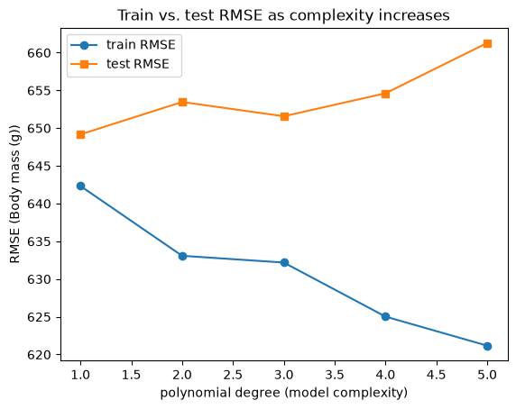
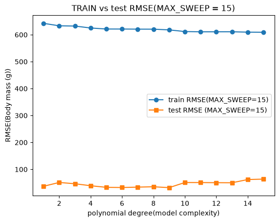

# Project Documentation

This site provides project documentation.
Use the documentation navigation to explore.

## How-To Guide

Many instructions are common to all our projects.

See
[⭐ **Workflow: Apply Example**](https://denisecase.github.io/pro-analytics-02/workflow-b-apply-example-project/)
to get the example projects running on your machine.

## Project Documentation Pages (docs/)

- **Home** - this documentation landing page
- [**Project Instructions**](./project-instructions.md)  - the standard project workflow
- [**Your Files**](./your-files.md) - how to copy the example and create your version
- [**Glossary**](./glossary.md) - project terms and concepts
- [**API**](./api.md) - autogenerated code documentation for the public project interface

## Phase 4. Technical Modification

Describe your small technical modification to the example project.

Include:

- What you changed
-   I changed the feature from flipper_length_mm to bill_length_mm. I also did a change in the polynomial sweep by trying out a lower value such as 5 and  a higher value of 15.
- Why you chose that change
I wanted to understand how the change affects the training and testing of the model and how the complexity affects overfitting.
- How you verified that it worked
-   At MAX_SWEEP = 5 both the train and test RMSE were moderate and stable. At MAX_SWEEP=15 train RMSE fell sharply while test RMSE rose showing that the model was over-fitting.
- What result, output, chart, metric, or behavior confirmed the change
When the MAX_SWEEP was within a good sweep range the train and test RMSE values were moderate however when the MAX_SWEEP was set to value above 10 the polynomial regression model became numerically unstable. WHen set to higher values they produce wild oscillations and Rank warnings started to appear as the predictions became unreliable.
      
Compared with the example project,
explain what is different and why the change matters.

In the example project, the model used flipper_length_mm as the feature and swept polymonial degrees from 1 to 10. In my modified version, I changed the feature to bill_length_mm and added a comparison between MAX_SWEEP = 5 and MAX_SWEEP =15.

Was it easy, or surprisingly challenging and why do you think so?

The modification was moderate. Changing the feature was easy, and comparing the changes to the model was interesting. The challenging part was understanding the RMSE curves and how the changes affected the model based on the feature modification gave me a deeper insight into model complexity.

## Phase 5. Custom Project

Describe your custom project and how you made your modeling decisions.
I made moderate chanhes to the custom model by making two changes,

I changed the feature used for prediction
I added a comparison of model complexity using two different ranges to understand and compare the changes in the model.

Be specific about what changed from the example project.
I kept the same dataset but changed the feature to explore a weaker linear relationship.

### Basis and Data

Describe the dataset, input, or example you started with.
Dataset: Seaborn Penguins
Target: body_mass_g
Feature: bill_length_mm

Include:

- The original example dataset or input
The example project uses the seaborn Penguins dataset, a small and already clean dataset that contains the measurements of peenguins such as flipper length, bill length, bill depth, and body mass.
- The data source
The dataset is from the Seaborn library and it provides a built in dataset for teaching and demonstration.
- Why you chose it, kept it, or changed it
I kept the dataset as it was simple and small and my main focus was to understand the working of the changes than to explore on a different dataset.
The changes I made was changeing the feature from flipper_length_mass to bill_length_mass and exploring the max_sweep along with the feature.
- Any important limitations or assumptions
Bill length is less strongly correlated with body mass so RMSE is expected to be higher.
Polynomial regression becomes unstable at high degrees especially with small dataset.

### Modeling Approach

Describe the problem type and modeling approach for this project.

Include:

- Is this supervised or unsupervised and how do you know
This is a supervised learning as the model learns from the labeled data(features+target)
- Is this classification, regression, clustering, recommendation, forecasting, or another type of ML task
It is a regression task because the target (body_mass_g) is numeric.
- What kind of target works well for this approach
Since this is a regression model, numeric and measurable targets related to quantity, price, temperature work better.
- Why your selected model or method is appropriate
The Polynomial regression allows exploration of complexity and overfitting.
### Target

Describe the example target variable.
The example project predicts body_mass_g which is numeric and ideal for regression.

Then describe your chosen target variable.

I kept the target variable unchanged and the target variable was body_mass_g.

Explain how your target choice changes the modeling approach, interpretation, or evaluation.

I wanted to keep the target variable unchanged so I can explore the combination of other features with it . Just changing the feature  helps me to understand the relationship between the feature and the target, the RMSE and the patterns.

### Features

Describe the example features.

The example feature is the flipper_length_mm which has a strong linear relationship with body mass.

Then describe the features you used to predict your target.
I changed the feature to bill_length_mm.

Explain what you changed, added, removed, or kept and why.
I changed the feature, and that in turn changed the RMSE which helped me understand the complexity .

### Evaluation and Results

Describe how you evaluated your model.

Include:

- The metric or evidence you used
The model uses
RMSE, Train vs TEst RMSE curves, and Residual plots.
- The main result
WHen the Max_Sweep was set to 5 the Train RMSE decreased slightly and the Test RMSE stayed stable which showed a stable model.
When the Max_Sweep was set to 15 the Train RMSE decreased while the Test RMSE Roose after degree 2 leading to a overfitting training data.
- Whether the result was useful, interesting, surprising, or disappointing
Yes the result and the comparison was very useful and gave me insights into the relationships of the feature and the RMSE curves and how the same feature can be used to stabilize a model and also casuse over fitting.
- Any weakness, limitation, or next improvement
There is more room for improvement by trying a larger dataset , trying to add different features.

### Summary

Summarize your custom project.

Include:

- How you implemented your custom model
I implemented a custom regression model using bill_length_mm as feature and added a comparison between MAX_SWEEP= 5 and MAX_SWEEP = 15 , to compare and observe the feature strength and model complexity effect on RMSE.
- What results you got
WHen the Max_Sweep was set to 5 the Train RMSE decreased slightly and the Test RMSE stayed stable which showed a stable model.
When the Max_Sweep was set to 15 the Train RMSE decreased while the Test RMSE Roose after degree 2 leading to a overfitting training data.
- What you learned
The feature choice strongly affects model accuracy , and when model complexity is set to a lower degree it stabilizes the model , however when the complexity increases it causes the model to become instable and causes overfitting.
- How well you exercised the skills covered in this project
I got  agood understanding on the Feature selection, Polynomial regression, Train/test evaluation , Visualization and interpretation.
- What kinds of real problems you could apply these skills to in the future
Since this is a Regression model it involves numeric predictions and can be applied to banking, sales, measurments, shares.

Display at least one image or screenshot showing your work.

